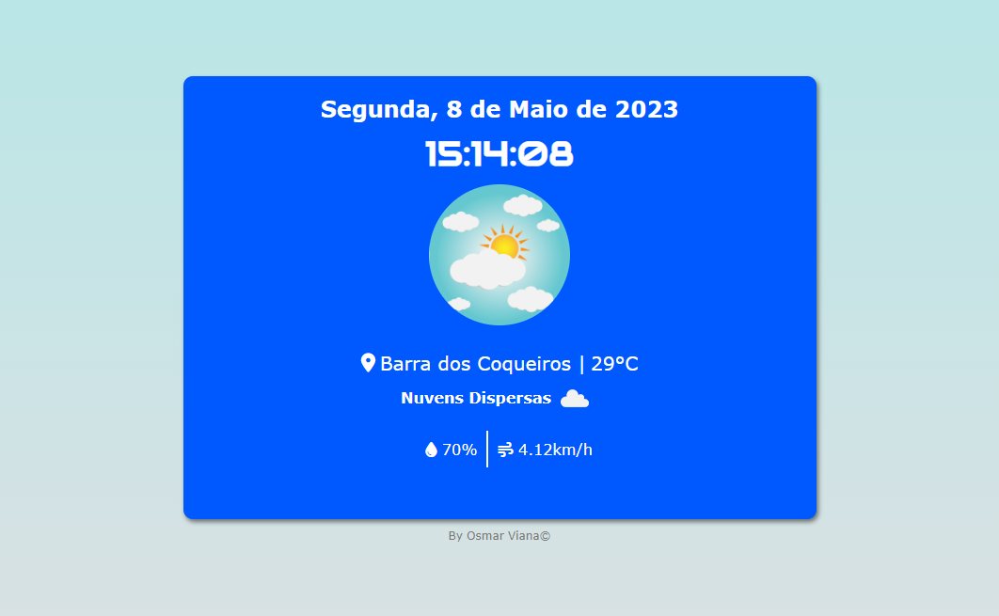
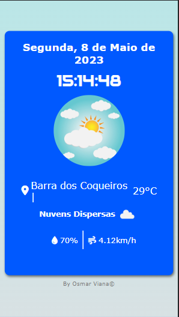

# Projeto Hora e dia

Consulte data, hora e clima de sua localidade. Isso foi possível através de consumo de API do clima e uso de função new Date.

### Objetivo

O projeto foi criado para praticar alguns conceitos básicos de JavaScript como variáveis, funções, eventos DOM, laços de repetição, estruturas condicionais e consumo de API.

 

### Tela Desktop

 

 

### Tela Mobile

 

 

## Ferramentas usadas

- HTML
- CSS
- JavaScript

 

## Links

https://osmarviana.github.io/hora-dia

 

# Autor

## Osmar Viana

 
  
   
  
   
  
   

